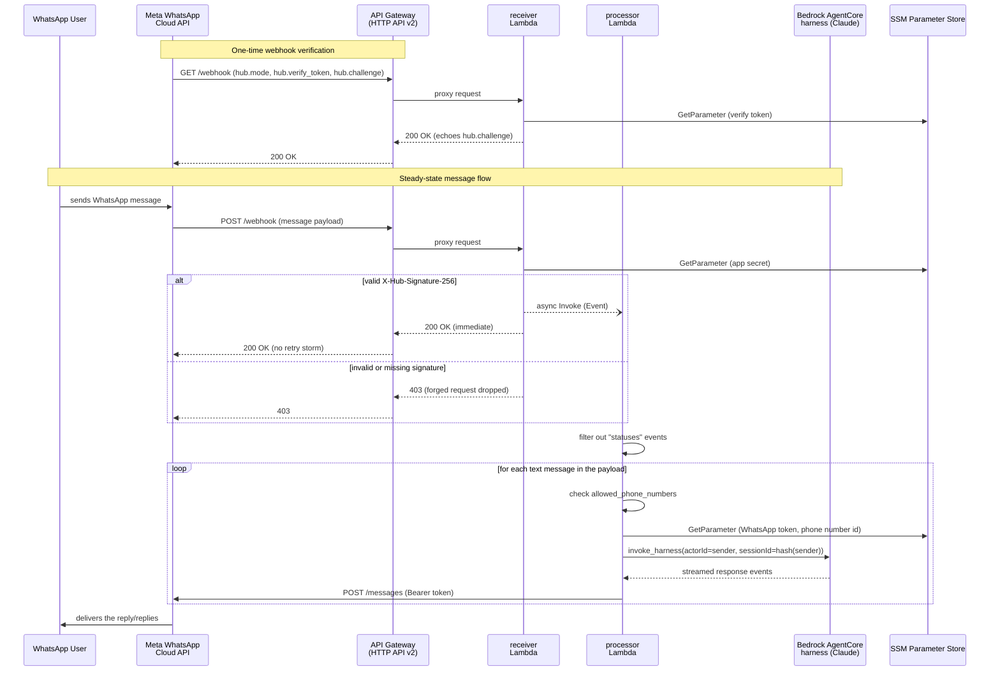

# terraform-aws-cloud-butler

A production-grade, open-source Terraform module that deploys a personal AI
assistant on **WhatsApp**, backed by **Amazon Bedrock AgentCore**, running
entirely on **AWS serverless infrastructure** (API Gateway + Lambda). No
servers, no containers, no external Python dependencies — just a handful of
managed services wired together with least-privilege IAM.

> Talk to your own private Claude-powered assistant from the WhatsApp app
> already on your phone, for a few cents a month.

---

## Architecture

Meta requires a webhook to respond with `200 OK` within a few seconds or it
starts retrying the same event, over and over. The assistant's model call can
comfortably take longer than that to generate a reply. This module solves
that with a **decoupled, asynchronous dual-Lambda pattern**: a thin
`receiver` acknowledges Meta instantly and hands off the real work to a
`processor` via an asynchronous Lambda invocation.

**Why Bedrock AgentCore, not "Bedrock Agents":** as of July 30, 2026, Amazon
Bedrock Agents ("Classic") is closed to any AWS account with no prior usage
of that service in the last 12 months, with no exception process — see
[AWS's own migration guide](https://docs.aws.amazon.com/bedrock/latest/userguide/agents-classic-maintenance-mode.html).
For a module anyone can newly deploy into their own account, that's a
dead end. AgentCore's managed harness (`aws_bedrockagentcore_harness`) is
AWS's recommended, unrestricted replacement: a model, a system prompt, and
managed per-user conversation memory, declared the same way — no container
or custom runtime to build.



Both Lambda functions are written using only the Python 3.12 standard
library and `boto3` (bundled with the runtime) — no `requests`, no other
third-party packages. That means Terraform's `data "archive_file"` can zip
and deploy each one directly: no Lambda Layer to build, no Docker image, no
separate packaging step in CI.

**Components:**

| Component | Purpose |
|---|---|
| **API Gateway (HTTP API v2)** | Public HTTPS endpoint. `GET /webhook` for Meta's verification handshake, `POST /webhook` for inbound events. |
| **`receiver` Lambda** | Verifies the handshake and the HMAC-SHA256 request signature; on a valid POST, returns `200 OK` immediately and asynchronously invokes `processor`. Never calls Bedrock — this is what prevents Meta retry storms. |
| **`processor` Lambda** | Filters out delivery/read receipts, processes every text message in the payload (a batch can hold more than one), enforces the phone number allow-list, calls the Bedrock AgentCore harness with each sender's number as `actorId` (scopes managed conversation memory) and a hash of it as `runtimeSessionId` (AWS requires ≥33 characters), decodes the streamed response, and replies via the WhatsApp Cloud API. |
| **Amazon Bedrock AgentCore harness** | The assistant itself — a configurable model (default: Claude Haiku 4.5, via a cross-region inference profile) with a mobile-chat-friendly system prompt and managed per-actor conversation memory. |
| **SSM Parameter Store** | Holds the WhatsApp permanent token, verify token, phone number ID, and App Secret as `SecureString` parameters. |
| **IAM** | `receiver` can only invoke `processor` and read the verify token and App Secret; `processor` can only invoke the AgentCore harness and read the WhatsApp token and phone number ID. |

---

## Usage

```hcl
module "whatsapp_assistant" {
  source = "github.com/ChengaDev/terraform-aws-cloud-butler"
  # Once published to the Terraform Registry, this can instead be:
  # source  = "ChengaDev/cloud-butler/aws"
  # version = "~> 1.0"

  name = "my-whatsapp-assistant"

  whatsapp_token           = var.whatsapp_token
  whatsapp_verify_token    = var.whatsapp_verify_token
  whatsapp_phone_number_id = var.whatsapp_phone_number_id

  # Only these numbers may talk to the assistant (E.164, no leading '+').
  allowed_phone_numbers = ["15551234567"]

  bedrock_model_id = "us.anthropic.claude-haiku-4-5-20251001-v1:0"
}

output "webhook_url" {
  value = module.whatsapp_assistant.webhook_url
}
```

A full runnable example lives in [`examples/complete`](./examples/complete).

```bash
cd examples/complete
cp terraform.tfvars.example terraform.tfvars
# edit terraform.tfvars with your real values
terraform init
terraform apply
```

> **Before applying, one-time AWS account setup** (each is per-account, not
> per-deployment — doing this once covers every future `apply`, including in
> other regions):
>
> 1. **Enable model access.** Bedrock console > **Model access** > enable the
>    Claude model you intend to use. Not on by default in a fresh account.
> 2. **Submit Anthropic's use-case-details form.** Bedrock console >
>    **Model catalog** > open any Anthropic model > if you see a banner
>    reading "Anthropic requires first-time customers to submit use case
>    details," click through it and submit (a couple of short fields — see
>    [CONTRIBUTING.md](./CONTRIBUTING.md) if you want the exact wording we
>    used). Skipping this fails invocation with an explicit error naming the
>    missing step, but it's easy to miss since it's separate from "Model
>    access" above.
> 3. **Pick an active, non-EOL model.** Bedrock model lifecycles change over
>    time — check the model's status in **Model catalog** before deploying.
>    Recent Claude models also require a cross-region inference profile ID
>    (the `us.` prefix, e.g. `us.anthropic.claude-haiku-4-5-20251001-v1:0`,
>    which is this module's default) rather than the bare on-demand model
>    ID — using the bare ID fails with "on-demand throughput isn't
>    supported."
>
> AgentCore is also only available in [a subset of regions](https://docs.aws.amazon.com/bedrock-agentcore/latest/devguide/agentcore-regions.html)
> (e.g. `us-east-1`) — pick one of those for your provider configuration.
> The module's own IAM policy already grants the AWS Marketplace
> subscription permissions Anthropic models need on Bedrock — no separate
> action required for that one.

---

## Reference

The tables below (Requirements, Resources, Inputs, Outputs) are generated
directly from the module's own `.tf` files by [terraform-docs](https://terraform-docs.io/),
so they can't drift out of sync with the actual code. Regenerate them after
changing any variable, output, or resource with:

```bash
terraform-docs -c .terraform-docs.yml .
```

<!-- BEGIN_TF_DOCS -->
## Requirements

| Name | Version |
|------|---------|
| <a name="requirement_terraform"></a> [terraform](#requirement\_terraform) | >= 1.5.0 |
| <a name="requirement_archive"></a> [archive](#requirement\_archive) | ~> 2.4 |
| <a name="requirement_aws"></a> [aws](#requirement\_aws) | ~> 6.0 |

## Resources

| Name | Type |
|------|------|
| [aws_apigatewayv2_api.this](https://registry.terraform.io/providers/hashicorp/aws/latest/docs/resources/apigatewayv2_api) | resource |
| [aws_apigatewayv2_integration.receiver](https://registry.terraform.io/providers/hashicorp/aws/latest/docs/resources/apigatewayv2_integration) | resource |
| [aws_apigatewayv2_route.get_webhook](https://registry.terraform.io/providers/hashicorp/aws/latest/docs/resources/apigatewayv2_route) | resource |
| [aws_apigatewayv2_route.post_webhook](https://registry.terraform.io/providers/hashicorp/aws/latest/docs/resources/apigatewayv2_route) | resource |
| [aws_apigatewayv2_stage.default](https://registry.terraform.io/providers/hashicorp/aws/latest/docs/resources/apigatewayv2_stage) | resource |
| [aws_bedrockagentcore_harness.this](https://registry.terraform.io/providers/hashicorp/aws/latest/docs/resources/bedrockagentcore_harness) | resource |
| [aws_cloudwatch_log_group.api_gateway](https://registry.terraform.io/providers/hashicorp/aws/latest/docs/resources/cloudwatch_log_group) | resource |
| [aws_cloudwatch_log_group.processor](https://registry.terraform.io/providers/hashicorp/aws/latest/docs/resources/cloudwatch_log_group) | resource |
| [aws_cloudwatch_log_group.receiver](https://registry.terraform.io/providers/hashicorp/aws/latest/docs/resources/cloudwatch_log_group) | resource |
| [aws_iam_role.bedrock_harness](https://registry.terraform.io/providers/hashicorp/aws/latest/docs/resources/iam_role) | resource |
| [aws_iam_role.processor](https://registry.terraform.io/providers/hashicorp/aws/latest/docs/resources/iam_role) | resource |
| [aws_iam_role.receiver](https://registry.terraform.io/providers/hashicorp/aws/latest/docs/resources/iam_role) | resource |
| [aws_iam_role_policy.bedrock_harness_permissions](https://registry.terraform.io/providers/hashicorp/aws/latest/docs/resources/iam_role_policy) | resource |
| [aws_iam_role_policy.processor_permissions](https://registry.terraform.io/providers/hashicorp/aws/latest/docs/resources/iam_role_policy) | resource |
| [aws_iam_role_policy.receiver_permissions](https://registry.terraform.io/providers/hashicorp/aws/latest/docs/resources/iam_role_policy) | resource |
| [aws_iam_role_policy_attachment.processor_basic_logs](https://registry.terraform.io/providers/hashicorp/aws/latest/docs/resources/iam_role_policy_attachment) | resource |
| [aws_iam_role_policy_attachment.receiver_basic_logs](https://registry.terraform.io/providers/hashicorp/aws/latest/docs/resources/iam_role_policy_attachment) | resource |
| [aws_lambda_function.processor](https://registry.terraform.io/providers/hashicorp/aws/latest/docs/resources/lambda_function) | resource |
| [aws_lambda_function.receiver](https://registry.terraform.io/providers/hashicorp/aws/latest/docs/resources/lambda_function) | resource |
| [aws_lambda_permission.apigw_invoke_receiver](https://registry.terraform.io/providers/hashicorp/aws/latest/docs/resources/lambda_permission) | resource |
| [aws_ssm_parameter.whatsapp_app_secret](https://registry.terraform.io/providers/hashicorp/aws/latest/docs/resources/ssm_parameter) | resource |
| [aws_ssm_parameter.whatsapp_phone_number_id](https://registry.terraform.io/providers/hashicorp/aws/latest/docs/resources/ssm_parameter) | resource |
| [aws_ssm_parameter.whatsapp_token](https://registry.terraform.io/providers/hashicorp/aws/latest/docs/resources/ssm_parameter) | resource |
| [aws_ssm_parameter.whatsapp_verify_token](https://registry.terraform.io/providers/hashicorp/aws/latest/docs/resources/ssm_parameter) | resource |
| [archive_file.processor](https://registry.terraform.io/providers/hashicorp/archive/latest/docs/data-sources/file) | data source |
| [archive_file.receiver](https://registry.terraform.io/providers/hashicorp/archive/latest/docs/data-sources/file) | data source |
| [aws_caller_identity.current](https://registry.terraform.io/providers/hashicorp/aws/latest/docs/data-sources/caller_identity) | data source |
| [aws_iam_policy_document.bedrock_harness_assume_role](https://registry.terraform.io/providers/hashicorp/aws/latest/docs/data-sources/iam_policy_document) | data source |
| [aws_iam_policy_document.bedrock_harness_permissions](https://registry.terraform.io/providers/hashicorp/aws/latest/docs/data-sources/iam_policy_document) | data source |
| [aws_iam_policy_document.lambda_assume_role](https://registry.terraform.io/providers/hashicorp/aws/latest/docs/data-sources/iam_policy_document) | data source |
| [aws_iam_policy_document.processor_permissions](https://registry.terraform.io/providers/hashicorp/aws/latest/docs/data-sources/iam_policy_document) | data source |
| [aws_iam_policy_document.receiver_permissions](https://registry.terraform.io/providers/hashicorp/aws/latest/docs/data-sources/iam_policy_document) | data source |
| [aws_partition.current](https://registry.terraform.io/providers/hashicorp/aws/latest/docs/data-sources/partition) | data source |
| [aws_region.current](https://registry.terraform.io/providers/hashicorp/aws/latest/docs/data-sources/region) | data source |

## Inputs

| Name | Description | Type | Default | Required |
|------|-------------|------|---------|:--------:|
| <a name="input_allowed_phone_numbers"></a> [allowed\_phone\_numbers](#input\_allowed\_phone\_numbers) | Allow-list of sender phone numbers, in E.164 format without a leading '+' (e.g. ["15551234567"]), permitted to use the assistant. Messages from any other number are silently dropped by the processor Lambda. | `list(string)` | n/a | yes |
| <a name="input_api_throttling_burst_limit"></a> [api\_throttling\_burst\_limit](#input\_api\_throttling\_burst\_limit) | Maximum burst of concurrent requests the webhook's API Gateway stage accepts before throttling (HTTP 429) the excess. This is the first line of defense in front of receiver, capping request volume before it can turn into Lambda invocations or Bedrock cost downstream. AWS's own account-wide default (in the thousands) applies if this were unset; this module sets an explicit, much lower default suited to personal-scale traffic. | `number` | `20` | no |
| <a name="input_api_throttling_rate_limit"></a> [api\_throttling\_rate\_limit](#input\_api\_throttling\_rate\_limit) | Steady-state requests per second the webhook's API Gateway stage accepts before throttling the excess. See api\_throttling\_burst\_limit for why this has an explicit, low default rather than inheriting AWS's account-wide default. | `number` | `10` | no |
| <a name="input_bedrock_agent_instructions"></a> [bedrock\_agent\_instructions](#input\_bedrock\_agent\_instructions) | System instructions that define the assistant's personality and response style. | `string` | `"You are a concise, practical personal assistant chatting with the user over WhatsApp.\nKeep replies short and mobile-friendly: prefer a couple of short paragraphs or a brief\nbullet list using a plain \"-\" for bullets. Never use markdown headers, bold/italic\nasterisks, or code fences, since WhatsApp displays plain text only. Be direct, warm, and\nhelpful, get straight to useful information, and ask a brief clarifying question when a\nrequest is ambiguous instead of guessing.\n"` | no |
| <a name="input_bedrock_harness_name"></a> [bedrock\_harness\_name](#input\_bedrock\_harness\_name) | Name of the Bedrock AgentCore harness. Must start with a letter and contain only letters, digits, and underscores (AWS's harness naming rule) — defaults to `name` with hyphens replaced by underscores. | `string` | `null` | no |
| <a name="input_bedrock_memory_retention_days"></a> [bedrock\_memory\_retention\_days](#input\_bedrock\_memory\_retention\_days) | How many days a WhatsApp conversation's memory (keyed by the sender's phone number as the AgentCore actor ID) is retained before it expires. AWS requires a value between 7 and 365. | `number` | `30` | no |
| <a name="input_bedrock_model_id"></a> [bedrock\_model\_id](#input\_bedrock\_model\_id) | Bedrock model ID used by the agent. Recent Claude models require a cross-region inference profile ID (the "us." prefix, e.g. "us.anthropic.claude-haiku-4-5-20251001-v1:0") rather than the bare on-demand model ID — using the bare ID fails at invocation time with "on-demand throughput isn't supported." The model also needs three one-time account setup steps, done once per AWS account: (1) enable it under Bedrock console > Model access, (2) submit Anthropic's one-time use-case-details form (shown on the model's page in the Bedrock console catalog if not yet done), (3) verify it isn't end-of-life — check Bedrock console > Model catalog for its lifecycle status, since model availability changes over time and an EOL model fails at invocation with a clear error. | `string` | `"us.anthropic.claude-haiku-4-5-20251001-v1:0"` | no |
| <a name="input_enable_lambda_logging"></a> [enable\_lambda\_logging](#input\_enable\_lambda\_logging) | Whether to create CloudWatch Log Groups for the receiver and processor Lambda functions and grant them permission to write to CloudWatch Logs. Set to false to opt the two functions out of logging entirely (e.g. to avoid ever writing message-related data to CloudWatch); API Gateway access logging is unaffected by this flag. | `bool` | `true` | no |
| <a name="input_log_retention_in_days"></a> [log\_retention\_in\_days](#input\_log\_retention\_in\_days) | CloudWatch Logs retention period, in days, applied to the Lambda and API Gateway log groups. Ignored for the Lambda log groups when enable\_lambda\_logging is false. | `number` | `14` | no |
| <a name="input_name"></a> [name](#input\_name) | Name prefix applied to every resource created by this module. Must be unique per AWS account/region if you deploy the module more than once. | `string` | `"whatsapp-assistant"` | no |
| <a name="input_processor_memory_size"></a> [processor\_memory\_size](#input\_processor\_memory\_size) | Memory, in MB, allocated to the processor Lambda function. | `number` | `256` | no |
| <a name="input_processor_reserved_concurrent_executions"></a> [processor\_reserved\_concurrent\_executions](#input\_processor\_reserved\_concurrent\_executions) | Maximum number of concurrent processor Lambda invocations. Caps how many simultaneous Bedrock AgentCore calls — and therefore how much cost — a burst of messages can generate, whether from legitimate heavy use, a compromised allowed sender, or Meta redelivering a backlog. Set to -1 to remove the limit and use the account's shared unreserved concurrency pool instead. The default of 5 is generous for a handful of personal users; invocations beyond the cap are throttled, and while Lambda retries asynchronous invocations automatically for a period, a burst that persists longer than that can mean some messages don't get a reply rather than queuing indefinitely. | `number` | `5` | no |
| <a name="input_processor_timeout"></a> [processor\_timeout](#input\_processor\_timeout) | Timeout, in seconds, for the processor Lambda function. Must comfortably exceed the Bedrock AgentCore harness's typical response time. | `number` | `90` | no |
| <a name="input_receiver_memory_size"></a> [receiver\_memory\_size](#input\_receiver\_memory\_size) | Memory, in MB, allocated to the receiver Lambda function. | `number` | `128` | no |
| <a name="input_receiver_timeout"></a> [receiver\_timeout](#input\_receiver\_timeout) | Timeout, in seconds, for the receiver Lambda function. Kept short since it only verifies the request and fires an asynchronous invocation. | `number` | `10` | no |
| <a name="input_tags"></a> [tags](#input\_tags) | Additional resource tags merged into every resource created by this module. | `map(string)` | `{}` | no |
| <a name="input_whatsapp_api_version"></a> [whatsapp\_api\_version](#input\_whatsapp\_api\_version) | Graph API version used when calling the WhatsApp Cloud API to send replies. | `string` | `"v21.0"` | no |
| <a name="input_whatsapp_app_secret"></a> [whatsapp\_app\_secret](#input\_whatsapp\_app\_secret) | App Secret of the Meta App (Developer Portal > App settings > Basic > App secret). Used to verify the HMAC-SHA256 signature (X-Hub-Signature-256) Meta attaches to every webhook POST, so forged requests to the public webhook URL are rejected before they can trigger a Bedrock invocation or a spoofed reply. | `string` | n/a | yes |
| <a name="input_whatsapp_phone_number_id"></a> [whatsapp\_phone\_number\_id](#input\_whatsapp\_phone\_number\_id) | Phone number ID of the WhatsApp Business sender, from the Meta Developer Portal > WhatsApp > API Setup page. | `string` | n/a | yes |
| <a name="input_whatsapp_token"></a> [whatsapp\_token](#input\_whatsapp\_token) | Permanent access token for the Meta WhatsApp Cloud API, generated for a System User in Meta Business Manager. Stored as a SecureString in SSM Parameter Store, never in plain Terraform state outputs. | `string` | n/a | yes |
| <a name="input_whatsapp_verify_token"></a> [whatsapp\_verify\_token](#input\_whatsapp\_verify\_token) | Arbitrary secret string you choose. Meta sends it back during the GET /webhook handshake and this module confirms it matches before returning the challenge. Enter the same value in the Meta Developer Portal's webhook configuration. | `string` | n/a | yes |

## Outputs

| Name | Description |
|------|-------------|
| <a name="output_api_gateway_endpoint"></a> [api\_gateway\_endpoint](#output\_api\_gateway\_endpoint) | Base invoke URL of the HTTP API Gateway, without the /webhook path. |
| <a name="output_api_gateway_id"></a> [api\_gateway\_id](#output\_api\_gateway\_id) | ID of the HTTP API Gateway fronting the webhook. |
| <a name="output_bedrock_harness_arn"></a> [bedrock\_harness\_arn](#output\_bedrock\_harness\_arn) | ARN of the Bedrock AgentCore harness that the processor Lambda invokes. |
| <a name="output_bedrock_harness_id"></a> [bedrock\_harness\_id](#output\_bedrock\_harness\_id) | ID of the Bedrock AgentCore harness backing the assistant. |
| <a name="output_processor_lambda_function_arn"></a> [processor\_lambda\_function\_arn](#output\_processor\_lambda\_function\_arn) | ARN of the processor Lambda function. |
| <a name="output_processor_lambda_function_name"></a> [processor\_lambda\_function\_name](#output\_processor\_lambda\_function\_name) | Name of the processor Lambda function. |
| <a name="output_receiver_lambda_function_arn"></a> [receiver\_lambda\_function\_arn](#output\_receiver\_lambda\_function\_arn) | ARN of the receiver Lambda function. |
| <a name="output_receiver_lambda_function_name"></a> [receiver\_lambda\_function\_name](#output\_receiver\_lambda\_function\_name) | Name of the receiver Lambda function. |
| <a name="output_ssm_parameter_names"></a> [ssm\_parameter\_names](#output\_ssm\_parameter\_names) | Names of the SSM SecureString parameters created for the Meta credentials. |
| <a name="output_webhook_url"></a> [webhook\_url](#output\_webhook\_url) | Public HTTPS webhook URL to configure as the Callback URL in the Meta Developer Portal (WhatsApp > Configuration). |
<!-- END_TF_DOCS -->

---

## Meta Developer Portal setup guide

You need a Meta App with the **WhatsApp** product added before applying this
module (you'll need the `phone_number_id` before you can set `terraform.tfvars`,
and you'll need the `webhook_url` output *after* applying, to finish the
webhook configuration — so this is a two-pass setup).

1. **Create a Meta App**
   Go to [developers.facebook.com/apps](https://developers.facebook.com/apps),
   create an app of type "Business", and add the **WhatsApp** product to it.

2. **Get a test phone number and its `phone_number_id`**
   Under **WhatsApp > API Setup**, Meta provisions a free test number. Copy
   the **Phone number ID** shown there — this is `whatsapp_phone_number_id`.

3. **Create a System User and generate a permanent token**
   Temporary tokens from the API Setup page expire in 24 hours, which is not
   useful in production:
   - Go to [business.facebook.com/settings](https://business.facebook.com/settings)
     > **Users > System Users**.
   - Click **Add**, create a system user with the **Admin** role.
   - Click **Add Assets**, select your app under **Apps**, and grant it
     **Full control**.
   - Click **Generate New Token**, select your app, and check the
     `whatsapp_business_messaging` and `whatsapp_business_management`
     permissions.
   - Copy the generated token immediately — Meta shows it only once. This is
     `whatsapp_token`.

4. **Pick a verify token**
   Make up any secret string yourself (e.g. `openssl rand -hex 32`). This is
   `whatsapp_verify_token` — you choose it, Meta doesn't issue it.

5. **Get the App Secret**
   Go to **App settings > Basic** in the Meta Developer Portal, click
   **Show** next to **App secret**, and copy it. This is `whatsapp_app_secret`
   — it lets the `receiver` Lambda verify that webhook POSTs genuinely came
   from Meta (via the `X-Hub-Signature-256` header) instead of an arbitrary
   forged request to your public webhook URL.

6. **Deploy this module**
   Fill in `terraform.tfvars` with the four values above plus your own
   phone number(s) in `allowed_phone_numbers`, then `terraform apply`. Note
   the `webhook_url` output.

7. **Configure the webhook**
   Back in the Meta Developer Portal, go to **WhatsApp > Configuration**:
   - **Callback URL**: paste the `webhook_url` output.
   - **Verify token**: paste the same value you used for `whatsapp_verify_token`.
   - Click **Verify and save** — Meta calls `GET /webhook`, which the
     `receiver` Lambda answers.
   - Under **Webhook fields**, subscribe to **messages**.

8. **Publish the app**
   An unpublished Meta app never delivers real webhook data — not even to
   its own admins/developers/testers — regardless of how correctly steps
   1-7 are configured. Go to **App Dashboard > Publish**, fill in a
   **Privacy policy URL** (any publicly reachable page describing what the
   assistant processes; it doesn't need to be elaborate), and click
   **Publish**. This is a separate, lighter step than Meta's Business
   Verification (needed only for using your own real phone number in
   production, not for the test number).

9. **Subscribe your app to the WhatsApp Business Account's webhook events**
   This is the step it's easiest to miss, because nothing in the
   Configuration UI above actually does it: verifying the Callback URL and
   checking "messages" under Webhook fields configures *your app's*
   webhook, but doesn't by itself tell the WhatsApp Business Account (WABA)
   to send *its* events to your app. Some WABAs come subscribed to a
   different, unrelated app by default (in testing, ours was subscribed to
   something called "WA DevX Webhook Events 1P App," not our own) — in
   that case Meta receives your messages just fine, but never forwards them
   to your Callback URL, and every log on the AWS side stays silent with no
   error anywhere to point at. Fix it with one API call:

   ```bash
   curl -X GET "https://graph.facebook.com/v21.0/{waba-id}/subscribed_apps" \
     -H "Authorization: Bearer {whatsapp_token}"
   ```

   If your app isn't in the returned list, subscribe it:

   ```bash
   curl -X POST "https://graph.facebook.com/v21.0/{waba-id}/subscribed_apps" \
     -H "Authorization: Bearer {whatsapp_token}"
   ```

   The WABA ID is the `id` field under `entry` in any webhook payload Meta
   has captured for it (visible in the Meta dashboard), or under **WhatsApp
   > API Setup** in the portal.

10. **Message the test number from an allow-listed phone**
    Add your own number as a recipient tester under **API Setup** (required
    for Meta's test numbers), then send it a WhatsApp message from a number
    listed in `allowed_phone_numbers`. You should get a reply from the
    assistant within a few seconds. If you send a message and get nothing
    back with zero errors anywhere in CloudWatch, re-check step 9 first —
    that silent-failure signature is exactly what an unsubscribed WABA
    looks like.

> To use your own real phone number in production (not Meta's shared test
> number) you additionally need to register a business phone number and
> complete Meta's Business Verification — the module and webhook wiring
> are identical either way.

---

## AWS cost analysis

This architecture is designed to sit inside the **AWS Free Tier** for
personal, low-volume use (a single user or a small circle of friends/family
texting an assistant occasionally):

| Service | Free Tier allowance (monthly, first 12 months except where noted) | Typical personal usage | Expected cost |
|---|---|---|---|
| **Lambda** | 1M requests + 400,000 GB-seconds compute, **always free** (not time-limited) | A few hundred invocations/month across both functions | **$0.00** |
| **API Gateway (HTTP API)** | 1M requests, first 12 months | A few hundred requests/month | **$0.00** |
| **SSM Parameter Store** (Standard `SecureString`) | Standard parameters are always free | 4 parameters, low read rate | **$0.00** |
| **CloudWatch Logs** | 5 GB ingestion + 5 GB storage, always free | Well under 1 GB/month at personal scale | **$0.00** |
| **Amazon Bedrock AgentCore** (Claude Haiku 4.5, on-demand, + managed memory) | No free tier — billed per input/output token, plus AgentCore's own consumption-based charges for memory storage/retrieval | ~50 short conversational exchanges/month, a few hundred tokens each | **≈ $0.05–$0.50/month** |

**Bottom line:** the entire serverless plumbing (API Gateway, Lambda, SSM,
CloudWatch) is covered by AWS's Free Tier for personal-scale traffic, so
**model invocation is effectively the only real cost**, typically well under
a dollar a month for casual personal use — AgentCore's memory feature adds a
small, usage-based amount on top of raw token cost, negligible at this
scale. Heavier use (long conversations, a larger model, many active users)
scales cost roughly linearly with tokens processed — check current
[Bedrock pricing](https://aws.amazon.com/bedrock/pricing/) and
[AgentCore pricing](https://aws.amazon.com/bedrock/agentcore/pricing/) for
your chosen model and region before scaling up `allowed_phone_numbers` to a
group.

---

## Redeploying and destroying

`terraform destroy` cleanly removes everything this module creates — the
full lifecycle has been tested end-to-end, not just `apply`. Two things
worth knowing if you destroy and recreate:

- **Wait a minute before re-applying with the same `name`.** The
  AgentCore harness's own destroy completes before its auto-created
  managed-memory resource finishes deleting (that resource stays in a
  `DELETING` state for roughly another minute). Recreating a harness with
  the same name during that window fails with `CreateMemory: Memory with
  name <name> already exists`. It isn't a permanent orphan — just retry
  `apply` after a short wait.
- **The webhook URL changes on every recreate.** API Gateway generates a
  new random subdomain each time `aws_apigatewayv2_api` is created, so
  after destroying and reapplying you'll need to paste the new
  `webhook_url` output into Meta's Callback URL field and re-verify.
  Everything else on the Meta side (app publish status, the WABA's
  webhook subscription, recipient testers, Model access) is unaffected —
  it lives at the account level, not tied to these AWS resources.

---

## Security notes

- Meta credentials are stored as SSM `SecureString` parameters (KMS-encrypted
  at rest with the AWS-managed `alias/aws/ssm` key), never in plain
  Terraform outputs or Lambda environment variables.
- `receiver` and `processor` each get their own IAM role scoped to exactly
  what they need: `receiver` can invoke only `processor` and read only the
  verify token and App Secret; `processor` can invoke only its own Bedrock
  AgentCore harness and read only the WhatsApp token and phone number ID.
- Every webhook POST is authenticated: `receiver` recomputes the
  HMAC-SHA256 of the raw body using the Meta App Secret and compares it
  against the `X-Hub-Signature-256` header Meta sends, rejecting anything
  that doesn't match with `403` before it ever reaches `processor` or
  Bedrock. Without this, a forged POST to the (public) webhook URL could
  claim to be from an allowed sender and rack up Bedrock invocations or
  trigger a spoofed reply.
- `allowed_phone_numbers` is enforced in `processor` on top of the signature
  check — messages from any other sender are dropped before ever reaching
  Bedrock.
- Mark `whatsapp_token`, `whatsapp_verify_token`, `whatsapp_phone_number_id`,
  and `whatsapp_app_secret` as sensitive in your own `.tfvars`/CI secrets
  handling; this module already marks them `sensitive` in `variables.tf` so
  they're redacted from `plan`/`apply` output.
- The AgentCore harness's own execution role (distinct from `receiver`'s and
  `processor`'s Lambda roles, which stay tightly scoped) is granted
  `bedrock-agentcore:*` rather than an enumerated action list: AWS doesn't
  document a fixed, minimal set of `bedrock-agentcore` calls the managed
  memory feature makes internally, and guessing an incomplete list fails
  memory continuity silently rather than loudly. It's scoped to that one
  role only, not to `receiver` or `processor`.

- Cost/abuse is bounded, not just access: `processor_reserved_concurrent_executions`
  (default `5`) caps how many simultaneous Bedrock AgentCore calls a burst of
  messages can generate, and `api_throttling_burst_limit`/`api_throttling_rate_limit`
  (defaults `20`/`10`) cap request volume at the API Gateway stage before it
  ever reaches a Lambda. Both are configurable — raise them if you expect
  genuinely heavier traffic, but the defaults are sized for a handful of
  personal users, not left unbounded. `receiver` deliberately has no
  concurrency cap of its own: it does almost no work (no Bedrock call), is
  already fronted by the API Gateway throttle above it, and capping it too
  would just add a second place a legitimate burst could get rejected
  without meaningfully reducing cost.

**Deliberately accepted trade-offs** (flagged by security scanners like
`checkov`, not fixed by design): the Lambdas run outside a VPC (a VPC would
require a NAT Gateway, ~$32/month, just to reach the public WhatsApp Graph
API and Bedrock endpoints — directly against this module's Free-Tier goal),
there's no Dead Letter Queue on the async `processor` invocation, no Lambda
code-signing, `log_retention_in_days` defaults to 14 days rather than the
1-year-plus a compliance-oriented deployment might want, and CloudWatch Log
Groups use AWS's default encryption rather than a customer-managed KMS key
(a CMK is a further $1/month per key). Each is a reasonable thing to add for
a larger deployment; none of them make sense as a forced default for a
personal, low-traffic assistant. See [CONTRIBUTING.md](./CONTRIBUTING.md) if
your use case needs one of these as an opt-in variable.

## Contributing

Issues and pull requests are welcome — see [CONTRIBUTING.md](./CONTRIBUTING.md)
for the required checks before opening a PR, and
[AGENTS.md](./AGENTS.md) if you're working with an AI coding agent (Claude
Code, Codex, Cursor, or otherwise) for the project's specific conventions
and known trade-offs. Found a security issue? See [SECURITY.md](./SECURITY.md)
for how to report it privately instead of opening a public issue.

## License

[MIT](./LICENSE)
